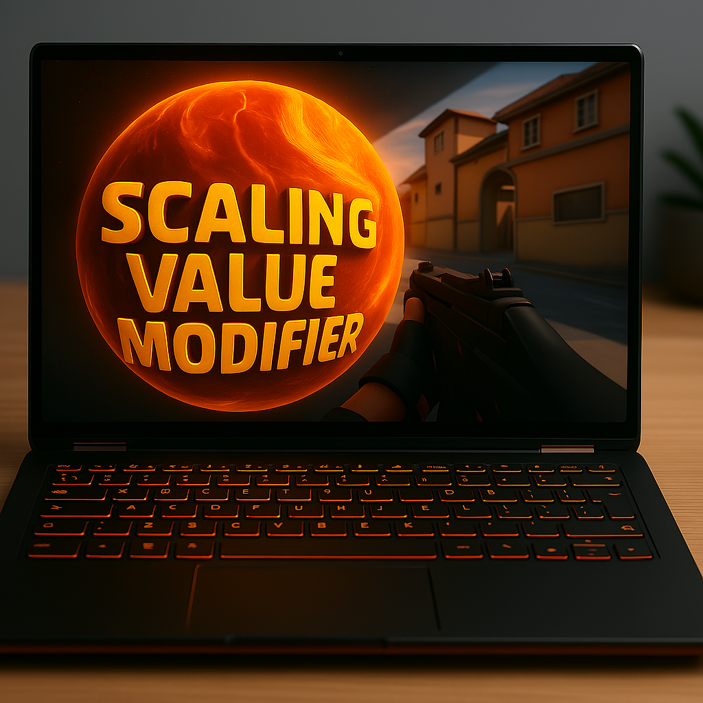

# Display Scaling Modifier

## 📌 Overview
A Windows tool that modifies display scaling registry settings to enable stretched resolutions on laptops without external monitors.

## 🚀 Features
- Modifies Windows display scaling registry settings
- Creates automatic registry backups
- Simple GUI with progress tracking

## 📥 Installation
1. Download the latest release from [GitHub](https://github.com/DragBridger/Scaling-Value-Modifier)
2. Run `DisplayScalingModifier.exe` as Administrator
3. Restart Laptop & Enjoy the stretched resolutions on laptop

## ⚠ Important Notes
- Changes require system restart

## ❓ FAQ
**Q: Is this safe to use?**  
A: The tool creates backups, but registry modifications always carry some risk.  `But we don't change risky settings, so i can say it's safe to use.`

**Q: What Windows versions are supported?**  
A: Tested on Windows 11 / 10 `LTS Versions`

**Q: How do I revert changes?**  
A: Double-click the backup `Scaling Value Modifier.reg` file created on your Desktop.

## 🙏 Support
If this tool helped you / have some issue:
- 👉 Discord `For Support` [Link Click](https://discord.gg/ucK2aRUcnY)
- ⭐ Star the [GitHub repo](https://github.com/DragBridger/Scaling-Value-Modifier)
- 🐛 Report any issues
- 🚀 Share with friends
##

